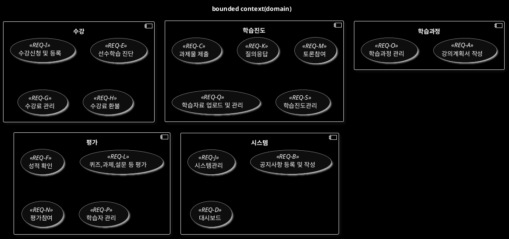
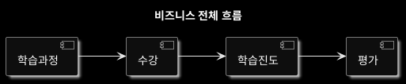

# Context-Map

```plantuml
@startuml
skinparam monochrome reverse
skinparam shadowing true 

title bounded context(domain)

component 학습과정 {
    (강의계획서 작성) as req_a <<REQ-A>>
    (학습과정 관리) as req_o <<REQ-O>>

} 
component 수강 {
    (수강신청 및 등록) as req_i <<REQ-I>>
    (선수학습 진단) as req_e <<REQ-E>>
    (수강료 관리) as req_g <<REQ-G>>
    (수강료 환불) as req_h <<REQ-H>>
} 
component 학습진도 {
        (과제물 제출) as req_c <<REQ-C>>
        (질의응답) as req_k <<REQ-K>>
        (토론참여) as req_m <<REQ-M>>
        (학습자료 업로드 및 관리) as req_q <<REQ-Q>>
        (학습진도관리) as req_s <<REQ-S>>
    }
component 평가 {
    (성적 확인) as req_f <<REQ-F>>
    (퀴즈,과제,설문 등 평가) as req_l <<REQ-L>>
    (평가참여) as req_n <<REQ-N>>
    (학습자 관리) as req_p <<REQ-P>>
} 

component 시스템 {
    (시스템관리) as req_j <<REQ-J>>
    (공지사항 등록 및 작성) as req_b <<REQ-B>>
    (대시보드) as req_d <<REQ-D>>
}

@enduml
```

```plantuml
@startuml
skinparam monochrome reverse
skinparam shadowing true 
left to right direction

title 비즈니스 전체 흐름

component 학습과정 as course
component 수강 as sign
component 학습진도 as progress
component 평가  as eval

course --> sign 
sign --> progress 
progress --> eval


@enduml
```