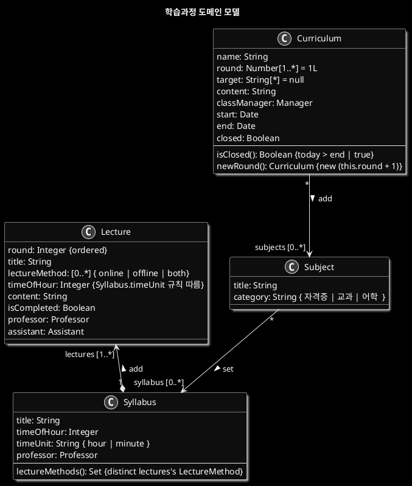
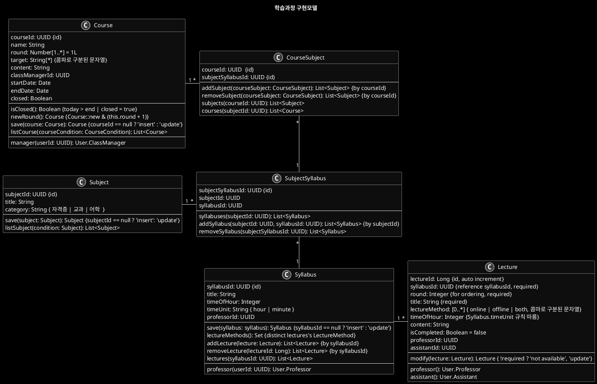

# 학습과정

## 개념 모델

```plantuml
@startuml
skinparam monochrome reverse
skinparam shadowing true

title 학습과정 도메인 모델  


class Syllabus {
	title: String
	timeOfHour: Integer
	timeUnit: String { hour | minute }
	professor: Professor 
	---
	lectureMethods(): Set {distinct lectures's LectureMethod}
}

class Lecture {
	round: Integer {ordered}
	title: String
	lectureMethod: [0..*] { online | offline | both}
	timeOfHour: Integer {Syllabus.timeUnit 규칙 따름}
	content: String
	isCompleted: Boolean	
	professor: Professor
	assistant: Assistant
}

Lecture "lectures [1..*]" <--* "1" Syllabus : add <

class Curriculum {
	name: String
	round: Number[1..*] = 1L
	target: String[*] = null
	content: String
	classManager: Manager
	start: Date
	end: Date
	closed: Boolean
	---
	isClosed(): Boolean {today > end | true} 
	newRound(): Curriculum {new (this.round + 1)}
}

class Subject {
	title: String
	category: String { 자격증 | 교과 | 어학  }
}


Curriculum "*" --> "subjects [0..*]"  Subject : add >

Subject "*" --> "syllabus [0..*]" Syllabus : set >


@enduml
```

## 구현모델  

```plantuml
@startuml
skinparam monochrome reverse

title 학습과정 구현모델 

class Course {
	courseId: UUID {id}
	name: String
	round: Number[1..*] = 1L
	target: String[*] {콤파로 구분된 문자열} 
	content: String
	classManagerId: UUID 
	startDate: Date
	endDate: Date
	closed: Boolean
	---
	isClosed(): Boolean {today > end | closed = true} 
	newRound(): Course {Course::new & (this.round + 1)}
	save(course: Course): Course {courseId == null ? 'insert' : 'update'}
	listCourse(courseCondition: CourseCondition): List<Course>
	---
	manager(userId: UUID): User.ClassManager
}

class CourseSubject {
	courseId: UUID  {id}
	subjectSyllabusId: UUID {id}
	---
	addSubject(courseSubject: CourseSubject): List<Subject> {by courseId}
	removeSubject(courseSubject: CourseSubject): List<Subject> {by courseId}
	subjects(courseId: UUID): List<Subject>
	courses(subjectId: UUID): List<Course>
}

class Subject {
	subjectId: UUID {id}
	title: String
	category: String { 자격증 | 교과 | 어학  }
	---
	save(subject: Subject): Subject {subjectId == null ? 'insert': 'update'}
	listSubject(condition: Subject): List<Subject>
}

class SubjectSyllabus {
	subjectSyllabusId: UUID {id}
	subjectId: UUID
	syllabusId: UUID
	---
	syllabuses(subjectId: UUID): List<Syllabus>
	addSyllabus(subjectId: UUID, syllabusId: UUID): List<Syllabus> {by subjectId}
	removeSyllabus(subjectSyllabusId: UUID): List<Syllabus>
}

class Syllabus {
	syllabusId: UUID {id}
	title: String
	timeOfHour: Integer
	timeUnit: String { hour | minute }
	professorId: UUID 
	---
	save(syllabus: syllabus): Syllabus {syllabusId == null ? 'insert' : 'update'}
	lectureMethods(): Set {distinct lectures's LectureMethod}
	addLecture(lecture: Lecture): List<Lecture> {by syllabusId}
	removeLecture(lectureId: Long): List<Lecture> {by syllabusId}
	lectures(syllabusId: UUID): List<Lecture> 
	---
	professor(userId: UUID): User.Professor
}
class Lecture {
	lectureId: Long {id, auto increment}
	syllabusId: UUID {reference syllabusId, required}
	round: Integer {for ordering, required}
	title: String {required}
	lectureMethod: [0..*] { online | offline | both, 콤마로 구분된 문자열}
	timeOfHour: Integer {Syllabus.timeUnit 규칙 따름}
	content: String
	isCompleted: Boolean = false
	professorId: UUID 
	assistantId: UUID 
	---
	modify(lecture: Lecture): Lecture { !required ? 'not available', 'update'}
	---
	professor(): User.Professor
	assistant(): User.Assistant
}

Course "1"-right-"*" CourseSubject
CourseSubject "*"--"1" SubjectSyllabus
Subject "1"-right-"*" SubjectSyllabus
SubjectSyllabus "*"--"1" Syllabus
Syllabus "1" --right-- "*" Lecture

@enduml
```
