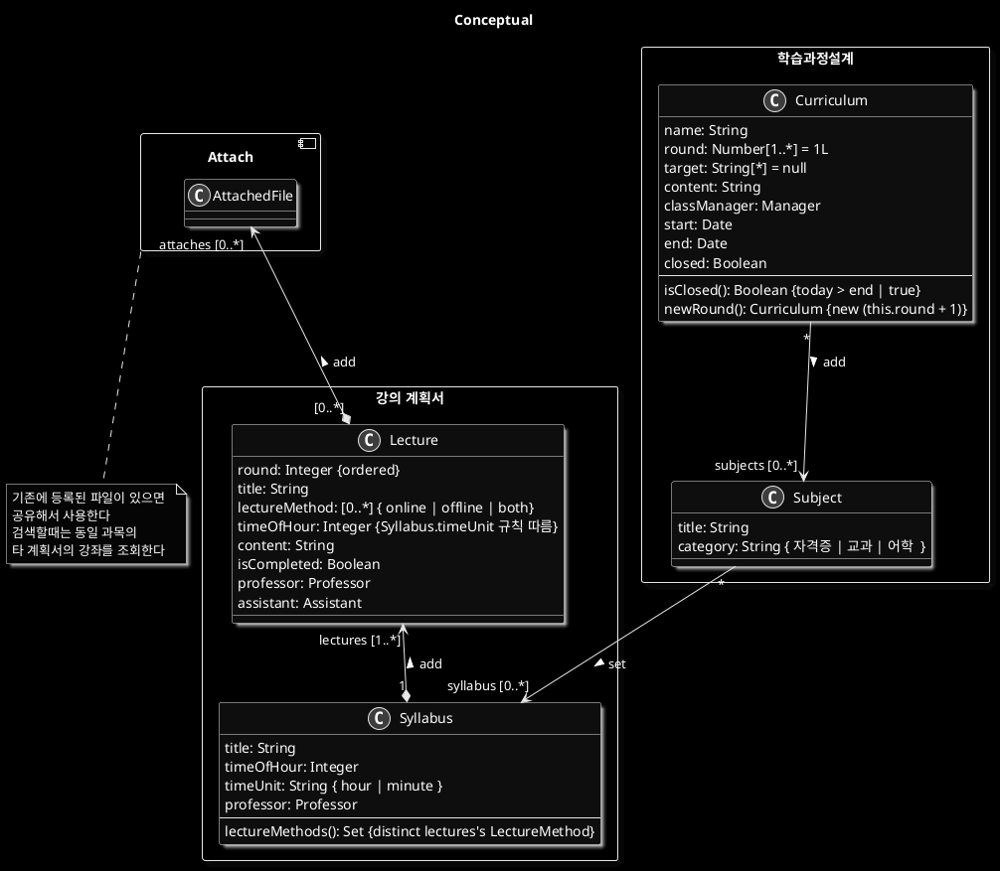

# 학습과정

## 개념 모델

```plantuml
@startuml
skinparam monochrome reverse
skinparam shadowing true

title Conceptual
rectangle "강의 계획서" {

	class Syllabus {
		title: String
		timeOfHour: Integer
		timeUnit: String { hour | minute }
		professor: Professor 
		---
		lectureMethods(): Set {distinct lectures's LectureMethod}
	}

	class Lecture {
		round: Integer {ordered}
		title: String
		lectureMethod: [0..*] { online | offline | both}
		timeOfHour: Integer {Syllabus.timeUnit 규칙 따름}
		content: String
		isCompleted: Boolean	
		professor: Professor
		assistant: Assistant
	}

	Lecture "lectures [1..*]" <--* "1" Syllabus : add <
}

rectangle "학습과정설계" {
	class Curriculum {
		name: String
		round: Number[1..*] = 1L
		target: String[*] = null
		content: String
		classManager: Manager
		start: Date
		end: Date
		closed: Boolean
		---
		isClosed(): Boolean {today > end | true} 
		newRound(): Curriculum {new (this.round + 1)}
	}

	class Subject {
		title: String
		category: String { 자격증 | 교과 | 어학  }
	}


	Curriculum "*" --> "subjects [0..*]"  Subject : add >
}

Subject "*" --> "syllabus [0..*]" Syllabus : set >


component Attach {
	class AttachedFile {}
}
note bottom of Attach 
기존에 등록된 파일이 있으면 
공유해서 사용한다
검색할때는 동일 과목의 
타 계획서의 강좌를 조회한다  
end note

Lecture "[0..*]" *-up-> "attaches [0..*]" AttachedFile : add >


@enduml
```

