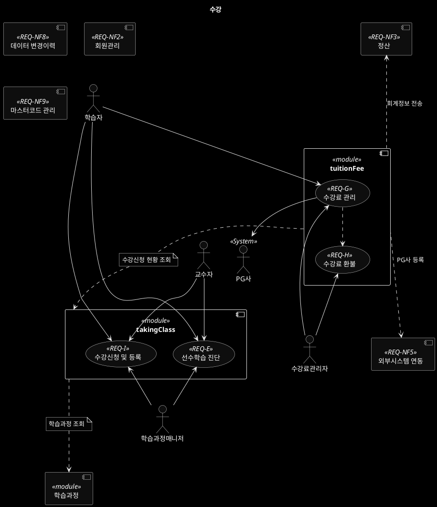

# 수강 

## 유스케이스

```plantuml
@startuml
skinparam monochrome reverse

title 수강

component "학습과정" <<module>> as learningCourse

[데이터 변경이력] <<REQ-NF8>>
[회원관리] <<REQ-NF2>>
[마스터코드 관리] <<REQ-NF9>>
[외부시스템 연동] <<REQ-NF5>>

:학습자: as student
:교수자: as professor
:학습과정매니저: as class_manager
:수강료관리자: as fee_manager
:PG사: as pg <<System>>

component takingClass <<module>> {
    (수강신청 및 등록) as req_i <<REQ-I>>
    (선수학습 진단) as req_e <<REQ-E>>
}

component tuitionFee <<module>> {
    (수강료 관리) as req_g <<REQ-G>>
    (수강료 환불) as req_h <<REQ-H>>
}
req_g ..> req_h 

note "수강신청 현황 조회" as N1
tuitionFee .. N1
N1 ..> takingClass  

class_manager -up-> req_i
class_manager -up-> req_e
fee_manager -up-> req_g
fee_manager -up-> req_h

professor --> req_i
professor --> req_e

student --> req_e
student --> req_g
student --> req_i

req_g --> pg

note "학습과정 조회" as N2
takingClass .. N2
N2 ..> learningCourse  

[정산] <<REQ-NF3>>
[정산] <-.. tuitionFee: 회계정보 전송

tuitionFee ...> [외부시스템 연동]: PG사 등록
@enduml
```