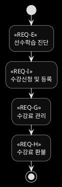

# 수강

## 전체 프로세스 




## 유스케이스별 프로세스

### REQ-I 수강신청 및 등록 

```plantuml
@startuml
skinparam monochrome reverse


@enduml
```

### REQ-E 선수학습 진단 

```plantuml
@startuml
skinparam monochrome reverse


@enduml
```

### REQ-G 수강료 관리 

```plantuml
@startuml
skinparam monochrome reverse


@enduml
```

### REQ-H 수강료 환불 

```plantuml
@startuml
skinparam monochrome reverse


@enduml
```

   