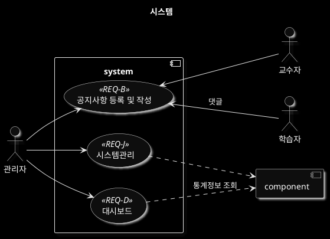

# 시스템 

```plantuml
@startuml
skinparam monochrome reverse
skinparam shadowing true
left to right direction

title 시스템

:교수자: as professor
:학습자: as student
:관리자: as manager
component system {
    (시스템관리) as req_j <<REQ-J>>
    (공지사항 등록 및 작성) as req_b <<REQ-B>>
    (대시보드) as req_d <<REQ-D>>
}

req_j ..> [component]
req_d ..> [component] : 통계정보 조회

professor -up-> req_b
student -up-> req_b : 댓글
manager --> req_j
manager --> req_d
manager --> req_b
@enduml
```
