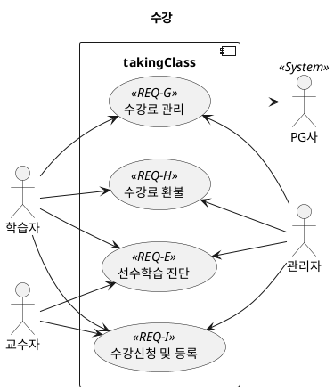

# 수강 

```plantuml
@startuml
left to right direction

title 수강

:학습자: as student
:교수자: as professor
:관리자: as manager
:PG사: as pg <<System>>

component takingClass {
    (수강신청 및 등록) as req_i <<REQ-I>>
    (선수학습 진단) as req_e <<REQ-E>>
    (수강료 관리) as req_g <<REQ-G>>
    (수강료 환불) as req_h <<REQ-H>>
}

manager -up-> req_i
manager -up-> req_e
manager -up-> req_g
manager -up-> req_h
professor --> req_i
professor --> req_e
student --> req_e
student --> req_g
student --> req_h
student --> req_i
req_g --> pg
@enduml
```

