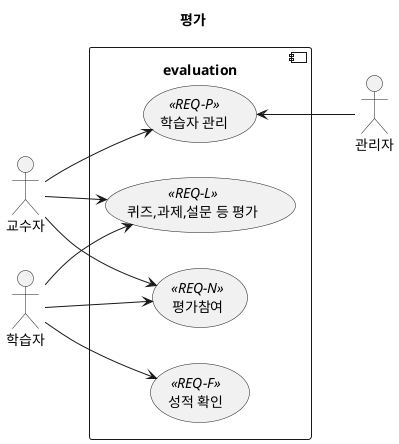

# 평가 

```plantuml
@startuml
left to right direction

title 평가 
:교수자: as professor
:학습자: as student
:관리자: as manager

component evaluation {
    (성적 확인) as req_f <<REQ-F>>
    (퀴즈,과제,설문 등 평가) as req_l <<REQ-L>>
    (평가참여) as req_n <<REQ-N>>
    (학습자 관리) as req_p <<REQ-P>>
}

professor --> req_l
professor --> req_p
professor --> req_n
student --> req_f
student --> req_l
student --> req_n
manager -up-> req_p
@enduml
```