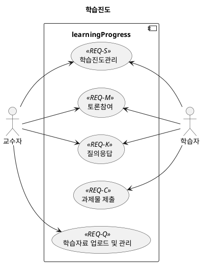

# 학습진도 

```plantuml
@startuml
left to right direction

title 학습진도 

:교수자: as professor
:학습자: as student

 component learningProgress {
        (과제물 제출) as req_c <<REQ-C>>
        (질의응답) as req_k <<REQ-K>>
        (토론참여) as req_m <<REQ-M>>
        (학습자료 업로드 및 관리) as req_q <<REQ-Q>>
        (학습진도관리) as req_s <<REQ-S>>
    }
professor --> req_k
professor --> req_m
professor --> req_q
professor --> req_s
student -up-> req_c
student -up-> req_k
student -up-> req_m
student -up-> req_s    
@enduml
```
