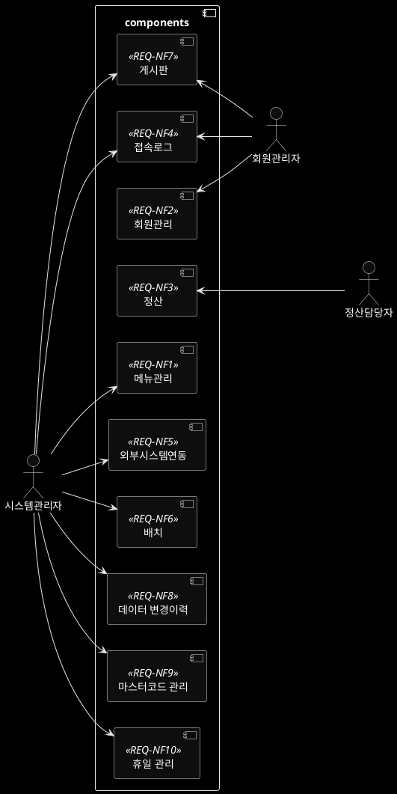

# Component Context

### 컴포넌트 

```plantuml
@startuml
skinparam monochrome reverse
left to right direction

component components {
    [메뉴관리] <<REQ-NF1>>
    [회원관리] <<REQ-NF2>>
    [정산] <<REQ-NF3>>
    [접속로그] <<REQ-NF4>>
    [외부시스템연동] <<REQ-NF5>>
    [배치] <<REQ-NF6>>
    [게시판] <<REQ-NF7>>
    [데이터 변경이력] <<REQ-NF8>>
    [마스터코드 관리] <<REQ-NF9>>
    [휴일 관리] <<REQ-NF10>>
}

:시스템관리자: --> [데이터 변경이력]
:시스템관리자: --> [메뉴관리]
:시스템관리자: --> [접속로그]
:시스템관리자: --> [외부시스템연동]
:시스템관리자: --> [배치]
:시스템관리자: --> [게시판]
:시스템관리자: --> [마스터코드 관리]
:시스템관리자: --> [휴일 관리]

:정산담당자: --up-> [정산]

:회원관리자: -up-> [회원관리]
:회원관리자: -up-> [접속로그]
:회원관리자: -up-> [게시판]

@enduml
```