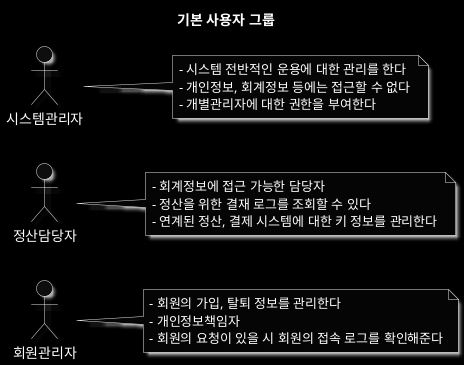
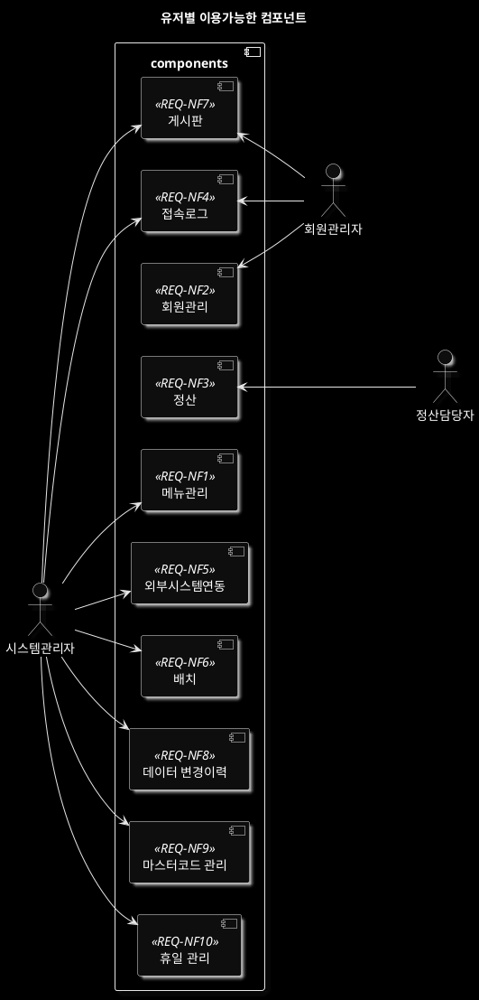

# Components

## default Users

```plantuml
@startuml
skinparam monochrome reverse
skinparam shadowing true
left to right direction

title 기본 사용자 그룹

:회원관리자:
note right of :회원관리자:
- 회원의 가입, 탈퇴 정보를 관리한다
- 개인정보책임자
- 회원의 요청이 있을 시 회원의 접속 로그를 확인해준다
endnote

:정산담당자:
note right of :정산담당자:
- 회계정보에 접근 가능한 담당자
- 정산을 위한 결재 로그를 조회할 수 있다
- 연계된 정산, 결제 시스템에 대한 키 정보를 관리한다 
endnote

:시스템관리자:
note right of :시스템관리자:
- 시스템 전반적인 운용에 대한 관리를 한다
- 개인정보, 회계정보 등에는 접근할 수 없다 
- 개별관리자에 대한 권한을 부여한다
endnote 
@enduml
```

## Users who use a components

```plantuml
@startuml
skinparam monochrome reverse
skinparam shadowing true
left to right direction

title 유저별 이용가능한 컴포넌트

component components {
    [메뉴관리] <<REQ-NF1>>
    [회원관리] <<REQ-NF2>>
    [정산] <<REQ-NF3>>
    [접속로그] <<REQ-NF4>>
    [외부시스템연동] <<REQ-NF5>>
    [배치] <<REQ-NF6>>
    [게시판] <<REQ-NF7>>
    [데이터 변경이력] <<REQ-NF8>>
    [마스터코드 관리] <<REQ-NF9>>
    [휴일 관리] <<REQ-NF10>>
}

:시스템관리자: --> [데이터 변경이력]
:시스템관리자: --> [메뉴관리]
:시스템관리자: --> [접속로그]
:시스템관리자: --> [외부시스템연동]
:시스템관리자: --> [배치]
:시스템관리자: --> [게시판]
:시스템관리자: --> [마스터코드 관리]
:시스템관리자: --> [휴일 관리]

:정산담당자: --up-> [정산]

:회원관리자: -up-> [회원관리]
:회원관리자: -up-> [접속로그]
:회원관리자: -up-> [게시판]

@enduml
```