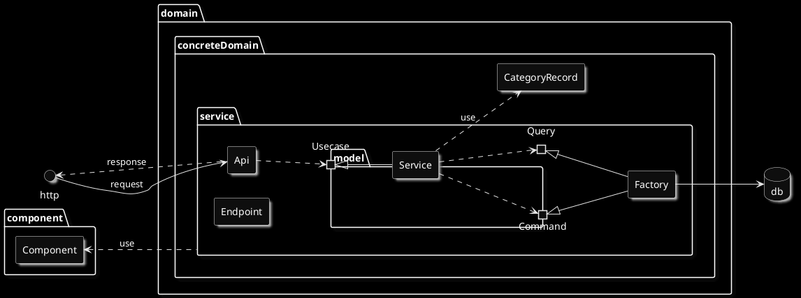

# Module 

```plantuml
@startuml
skinparam monochrome reverse
skinparam shadowing true
left to right direction

interface http


package component {
    rectangle Component
}

package domain {

    package concreteDomain {
        rectangle CategoryRecord 

        package service {
            rectangle Api
            rectangle Factory
            rectangle Endpoint

            package model {
                portin Usecase
                portout Query
                portout Command

                rectangle Service 
            }
        }

        http --> Api: request
        http <.. Api: response
        Api ..> Usecase

        Usecase <|-- Service
        Service ..> Command
        Service ..> Query
        Service ..> CategoryRecord: use 

        Command <|-- Factory
        Query <|-- Factory
    }
}

service .up.> Component : use

database db
Factory --> db
@enduml
```