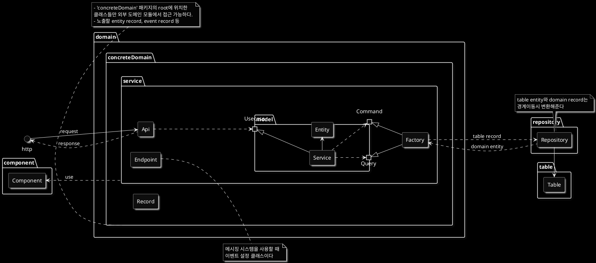

# Module 

```plantuml
@startuml
skinparam monochrome reverse
skinparam shadowing true
left to right direction

interface http

package repository {
    rectangle Repository
}

package table {
    rectangle Table
}

Repository -left-> Table

package component {
    rectangle Component
}

package domain {

    package concreteDomain {
        rectangle Record 

        package service {
            rectangle Api
            rectangle Factory
            rectangle Endpoint

            package model {
                portin Usecase
                portout Query
                portout Command

                rectangle Entity 
                rectangle Service 
            }
        }

        http --> Api: request
        http <.. Api: response
        Api ..> Usecase

        Usecase <|-- Service
        Service ..> Command
        Service ..> Query
        Service -left-> Entity

        Command <|-- Factory
        Query <|-- Factory
    }
}

service .up.> Component : use
Factory  ..> Repository : table record
Factory <.. Repository : domain entity


note bottom of concreteDomain
- 'concreteDomain' 패키지의 root에 위치한 
클래스들만 외부 도메인 모듈에서 접근 가능하다. 
- 노출할 entity record, event record 등
endnote
note right of Endpoint 
메시징 시스템을 사용할 때 
이벤트 설정 클래스이다
endnote
note bottom of Repository
table entity와 domain record는
경계이동시 변환해준다 
endnote
@enduml
```